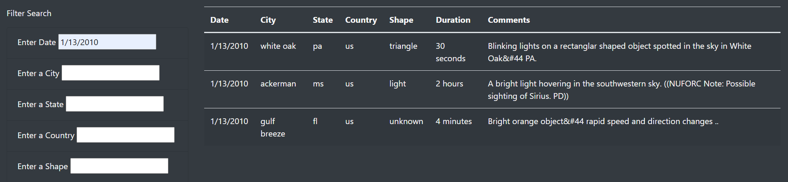

# UFOs
## Overview of Project:
In this analysis, we will check UFO sightings around the world by allowing users to filter for multiple criteria at the same time.

## Results:
We built a table using data stored in a JavaScript array and created filters to make this table fully dynamic. 
In the table, we have several fully functional filters like date, city, state, country, and shape that allow users to interact with our visualizations.

In this webpage, the user can type parameters in the filter search and see the result in the table:
For example, by taping 1/31/2010, we can see in the chart all the UFOs reported this day. 

In the same way, when we look at the city, we can see all the reports for the filtered city. 

We can choose one parameter or all five.
In the example below, we can see the reports when we filter date and city together. 
## Overview of Project:
In this analysis, we will check UFO sightings around the world by allowing users to filter for multiple criteria at the same time.

## Results:
We built a table using data stored in a JavaScript array and created filters to make this table fully dynamic. 
In the table, we have several fully functional filters like date, city, state, country, and shape that allow users to interact with our visualizations.

In this webpage, the user can type parameters in the filter search and see the result in the table:
For example, by taping 1/31/2010, we can see in the chart all the UFOs reported this day. 

In the same way, when we look at the city, we can see all the reports for the filtered city. 

We can choose one parameter or all five.
In the example below, we can see the reports when we filter date and city together.

## Summary:
-- Drawback-  one of the drawbacks of this design is that we can't see statistical information. We don't know on what date there were the most reports of UFOs and we don't know in what city\state\contry there are the most reports. 
-- Recommendation: 
--- Adding statistical information for the table. 
--- Adding option to filter the data from the most recurring date, city, state, country, and shape
